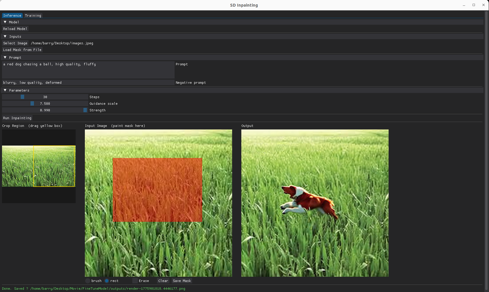
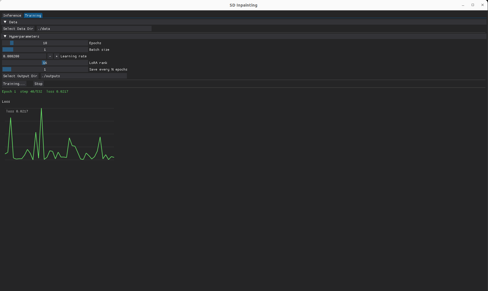

# (Local) GUI for SD 1.5 - Inpainting
Basic drawing functionality and +/- prompt inputs for mask-based inpainting.

A GUI & pipeline for diffusion inference and finetuning (+ inference while finetuning).

The Inference GUI (using `dearpygui`):
- Load image as a thumbnail with,
    - Dragable square for selecting `512x512` pixel patches for inference
- Pass pixel patch to Mask-creation window. Masks are drawn with:
    - Circular brush/eraser with adjustable sizing
    - AABB click & drag rectangles
- Load the model and show output to the viewer
    - Results saved in `./outputs`




The Traniing GUI:
- Load model on the Inference GUI tab
- Configure the settings in the training tab
- Hit run and plot the loss



## Models
- SD v1.5 - Inpainting
- VAE `vae-ft-mse-840000-ema-pruned`

# Installation: PyTorch 2.6 with CUDA 12.4
```
conda create -n sd-inpaint python=3.11
conda activate sd-inpaint

pip install torch==2.6.0+cu124 torchvision torchaudio --index-url https://download.pytorch.org/whl/cu124
pip install diffusers transformers accelerate peft omegaconf safetensors Pillow numpy tqdm dearpygui
```

# Running
```
bash run.sh # Use to hardcode arguments

python run.py \
  -- confgi-path [path to training data config.json] 
```


# Folder Management
## On installation:
- Add `checkpoint`/`outputs` folders
- Add a folder for `vae` and `inpainting` in the checkpoints and place the checkpoint there
- Update paths in `modules/inpainting.py` if needed

## Additional information
- Configs are found in `arguments/config.json`
- If you want to train your pipe, you can include a subset config file and point to it by using the argument `--config-path [path to your config]` when running GUI
